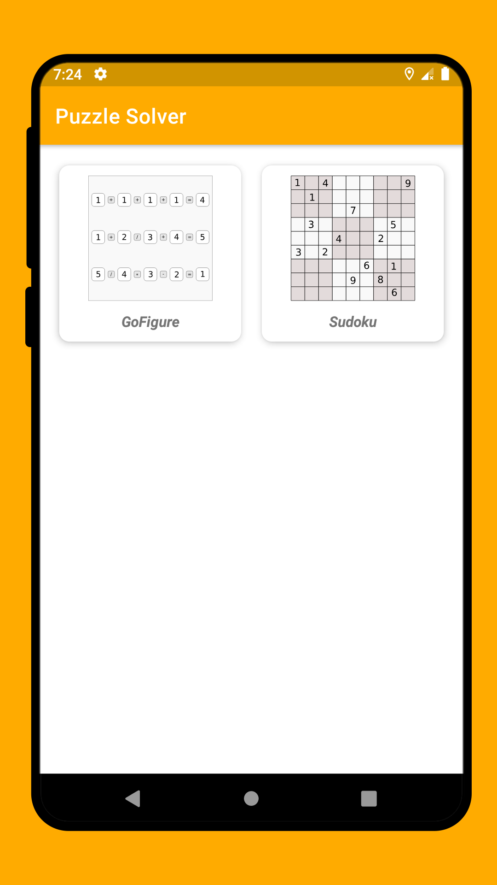
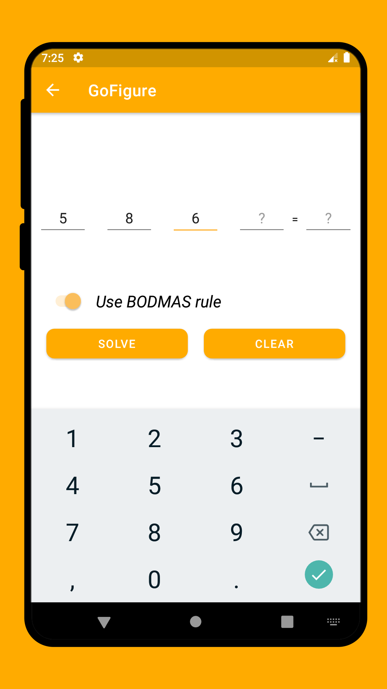
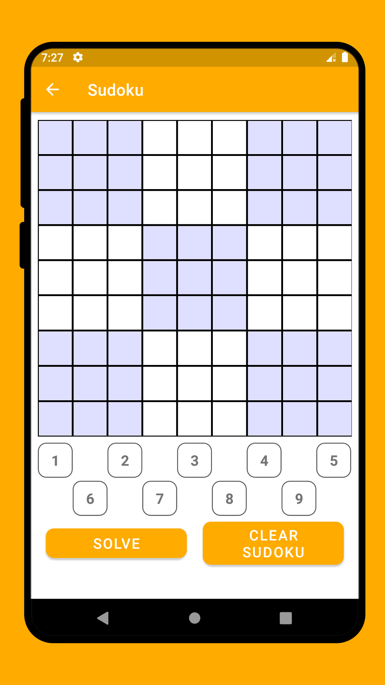
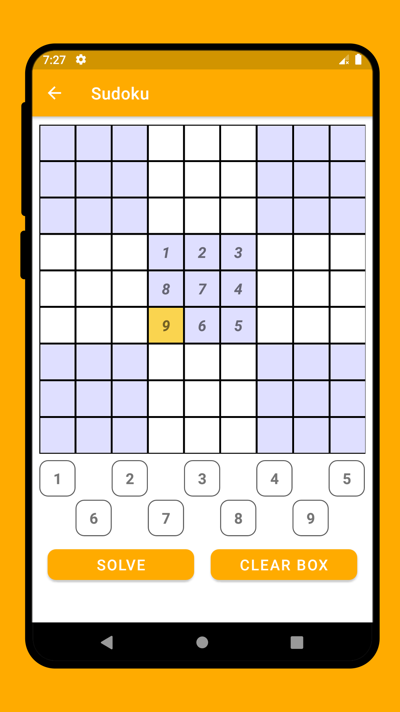

# Puzzle Solver

<table>
    <tr>
        <th>Title</th>
        <td>Puzzle Solver - GoFigure, Sudoku</td>
    </tr>
    <tr>
        <th>Short description</th>
        <td>Get solution to various puzzles found in newspapers / magazines / other sources</td>
    </tr>
    <tr>
        <th>Full description</th>
        <td>Currently the puzzle only solves - GoFigure and Sudoku puzzle.   In Future we would be adding various other puzzles.   This is an open source project, you can get its source code at [Kashew-developers/PuzzleSolver](https://github.com/kashew-developers/PuzzleSolver).</td>
    </tr>
    <tr>
        <th>YouTube</th>
        <td>https://youtu.be/pIBMqkJC7wo</td>
    </tr>
</table>

----

#### Screenshots

<table>
    <tr>
        <td></td>
        <td></td>
        <td></td>
        <td></td>
    </tr>
    <tr>
        <td></td>
        <td></td>
        <td></td>
        <td></td>
    </tr>
</table>
